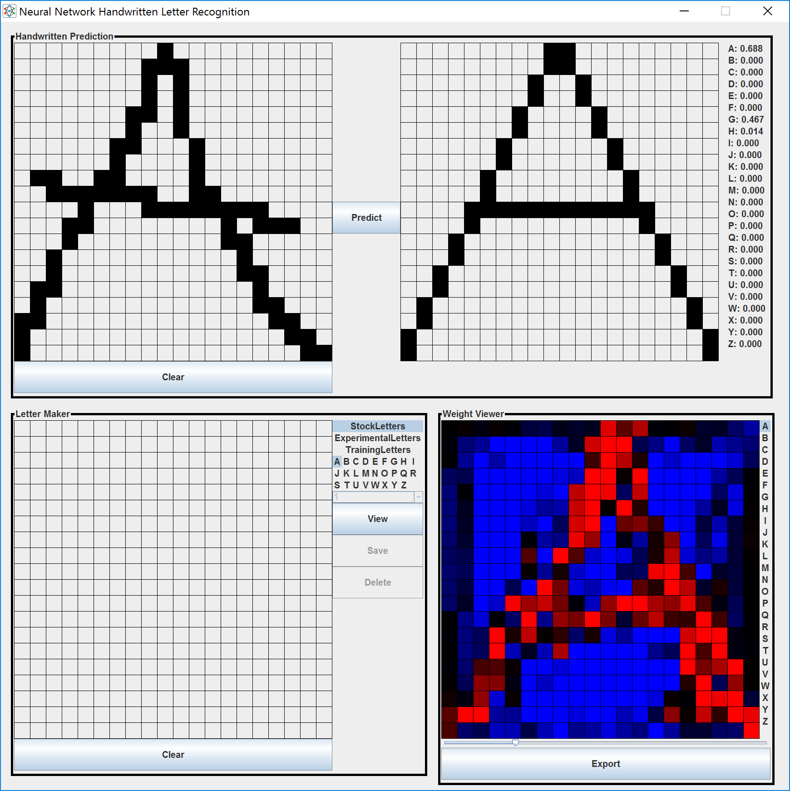

# Handwritten-Recognition

<h2>About</h2>
This project was created to recognize handwritten digits using nerual networks.  It provides a user interface for drawing a letter and the program will use a neural network using various learning methods to determine the letter drawn.  The artificial neural network can learn from training data using supervised or unsupervised learning methods.  Additionally, includes functionality for displaying weights graphically and outputting runtime data from the neural networks to data files.  Additionally, the program allows the user to save their own drawn letters to either the experimental or training data set.

This program supports the use of custom training methods that can be used by extending the LearningMethod.java file.  Built in support includes the backpropagation, genetic and momentum algorithms.

Written in the Java Programming Language

<h2>How to use</h2>
In the main package, run the class Main.java to get the visual interface for drawing, prediction and saving functionality.  To just run training tests that output the neural network's performance to a file, run the Trainer.java in the neural_networks package.

<h2>Purpose</h2>
The purpose of this project was to gain an understanding of how neural networks work.  The results of the experiment conclude that training algorithms that rely more directly on the training data (like the backpropagation algorithm, and not the genetic algorithm) will be more specific about the shape of the letter that needs to be inputted, while training algorithms that did not rely on training data tend to be able to classify more shapes of letters that don't fit exactly one shape.

<h2>Images</h2>

<h3>Visual interface for drawing, predicting and storing handwritten letters.</h3>

<h3>Sample weight map output from the genetic algorithm.</h3>

<h3>Experimental letters used for testing the neural network.</h3>

